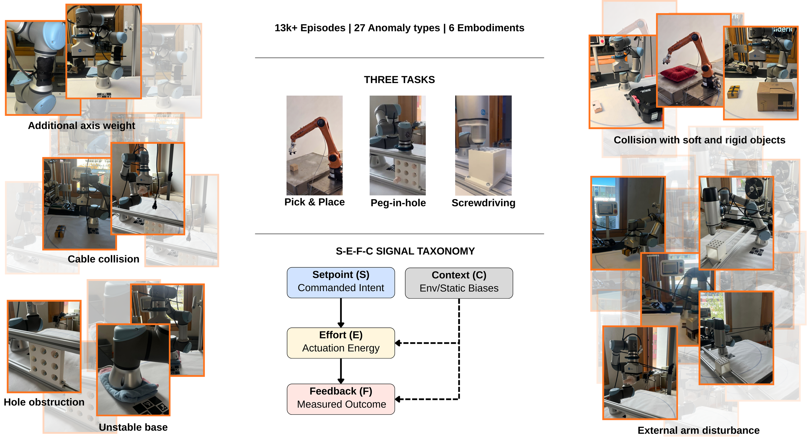

# FactoryNet: A Large-Scale Dataset toward Industrial Time-Series Foundation Models

[](https://www.forgis.com)
[](https://arxiv.org/abs/2605.09081)
[](https://huggingface.co/datasets/factorynet/factorynet)

**Team:** Karim Othman, Jonas Petersen, Matei Ignuta-Ciuncanu, Camilla Mazzoleni, Federico Martelli, Alessandro Lombardi, Riccardo Maggioni, Philipp Petersen

We introduce the first universal pretraining corpus for industrial time-series data: FactoryNet. 51M datapoints across 23k end-to-end task executions (13.3k real, 9.8k synthetic) on six embodiments, unified by a shared schema that enables robust zero-shot cross-embodiment transfer and highly parameter-efficient anomaly detection. We introduce a novel schema: Setpoint, Effort, Feedback, Context (S-E-F-C) underlying the whole pipeline that maps any actuated system into a common representational frame. The corpus spans 27 annotated anomaly types alongside healthy baselines and counterfactual pairs across robotic manipulation and machining domains. Cross-embodiment transfer experiments yield positive results: under bias-aware metrics our model demonstrates fair cross-embodiment transfer capabilities on the evaluated source-target pair, while 24 schema-aligned signals achieves competitive anomaly detection performance compared to high-dimensional baselines. We release FactoryNet as a growing, multi-embodiment dataset to drive progress toward industrial foundation models.

<p align="center">
  
</p>

## Key Numbers

| | |
|---|---|
| **Episodes** | 23,000+ (13.3k real, 9.8k synthetic) |
| **Datapoints** | 51M |
| **Embodiments** | 6 (UR3e, KUKA KR10, Yu-Cobot, UR5 sim, CNC, UR3e-AURSAD) |
| **Tasks** | Pick and Place, Peg-in-Hole, Screwdriving |
| **Anomaly types** | 27 fault categories |
| **Signal schema** | Setpoint, Effort, Feedback, Context (S-E-F-C) |

## Quick Start

```bash
pip install datasets
```

```python
from datasets import load_dataset

ds = load_dataset("factorynet/factorynet")
```

## S-E-F-C Schema

FactoryNet organizes all signals under a machine-agnostic, control-theoretic decomposition grounded in the IEC 81346 industrial standard:

- **Setpoint (S)**: Commanded references (target positions, velocities)
- **Effort (E)**: Applied forces and torques
- **Feedback (F)**: Measured sensor readings (actual positions, velocities)
- **Context (C)**: Environmental and metadata signals (timestamps, labels, task phase)

## Citation

```bibtex
@inproceedings{othman2026factorynet,
  title     = {FactoryNet: A Large-Scale Dataset toward Industrial
               Time-Series Foundation Models},
  author    = {Othman, Karim and Petersen, Jonas and Ignuta-Ciuncanu, Matei
               and Mazzoleni, Camilla and Martelli, Federico and Lombardi,
               Alessandro and Maggioni, Riccardo and Petersen, Philipp},
  journal   = {arXiv preprint arXiv:2605.09081},
  year      = {2026}
}
```

## License

Copyright (c) 2026, Forgis Labs. All rights reserved. Licensed under the [Forgis Source Code License (Non-Commercial)](LICENSE.txt).
